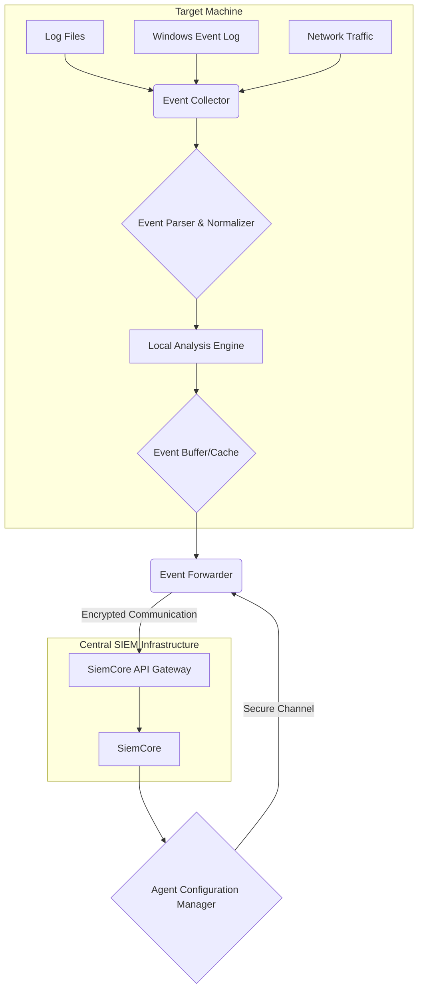

# SIEM Agent: Architecture and Specifications

## 1. Introduction

This document outlines the architecture and technical specifications for the distributed SIEM Agent. This agent is a lightweight, cross-platform service designed to be installed on network devices and target machines. Its primary purpose is to monitor local security events, perform initial analysis and filtering, and securely forward relevant data to the central `SiemCore` application. This enables a distributed and scalable security monitoring environment.

## 2. High-Level Architecture

The SIEM Agent operates as a background service on the host machine. It collects data from various sources, processes it locally, and sends it to the `SiemCore` application for centralized storage, correlation, and advanced analysis.

**Figure 1: SIEM Agent High-Level Architecture**

### 2.1. Core Components

*   **Event Collectors**: Pluggable modules responsible for collecting data from various sources on the host system.
*   **Event Parser & Normalizer**: A component that parses raw log data and normalizes it into the standardized `SiemEvent` format.
*   **Local Analysis Engine**: A lightweight engine for preliminary event analysis, filtering, and aggregation to reduce data volume and noise before forwarding.
*   **Event Buffer/Cache**: A local buffer to temporarily store events, ensuring data is not lost if the connection to the central server is unavailable.
*   **Event Forwarder**: A secure component responsible for transmitting processed events to the `SiemCore` application.
*   **Configuration Manager**: A module that periodically fetches and applies configuration updates from the central `SiemCore` application.
*   **Health Monitor**: A self-monitoring component that reports the agent's health, performance metrics, and any operational issues.

## 3. Technical Specifications

### 3.1. General Specifications

*   **Programming Language**: C#
*   **Framework**: .NET 8 (as a lightweight background service/worker process)
*   **Platform**: Cross-platform (Windows, Linux)
*   **Deployment**: Can be run as a Windows Service or a Linux daemon.

### 3.2. Communication

*   **Protocol**: HTTPS for event forwarding to the `SiemCore` API. This ensures secure and reliable communication over standard web protocols.
*   **Data Format**: JSON. Events will be serialized to JSON before being sent to the `SiemCore` API.
*   **Authentication**: The agent will authenticate with the `SiemCore` API using a unique API key or a client certificate. This will be configurable.

### 3.3. Resource Management

*   **CPU and Memory**: The agent will be designed to be lightweight and have a minimal impact on the host system. Resource usage will be configurable to prevent interference with critical applications.
*   **Throttling**: The agent will implement throttling mechanisms to control the rate of event collection and forwarding.

### 3.4. Offline Caching

*   **Mechanism**: The agent will use a local, lightweight database (e.g., SQLite or a file-based queue) to cache events if the `SiemCore` application is unreachable.
*   **Retry Logic**: The agent will implement an exponential backoff retry mechanism for sending cached events once the connection is restored.

### 3.5. Security

*   **Secure Communication**: All communication with the `SiemCore` application will be encrypted using TLS 1.2+.
*   **Configuration Security**: Agent configuration, including API keys, will be stored securely on the host system.
*   **Code Integrity**: The agent executable and its modules will be digitally signed to prevent tampering.

## 4. Deployment and Management

### 4.1. Installation

*   **Windows**: The agent will be packaged as an MSI installer that registers it as a Windows Service.
*   **Linux**: The agent will be distributed as a package (e.g., .deb, .rpm) that sets it up as a systemd service.

### 4.2. Configuration

*   **Initial Configuration**: A local `appsettings.json` file will be used for initial configuration (e.g., `SiemCore` API endpoint, API key).
*   **Remote Configuration**: The agent will periodically poll the `SiemCore` application for updated configuration profiles. This allows for centralized management of agent settings, including collector configurations, filtering rules, and resource limits.

### 4.3. Updates

*   **Mechanism**: The agent will support a remote update mechanism. The `SiemCore` application will be able to trigger an update, and the agent will download and install the new version securely.

## 5. Development Plan

The development of the SIEM Agent will follow the established plan, starting with the implementation of the core components and communication channels for event collection, processing, and forwarding.

